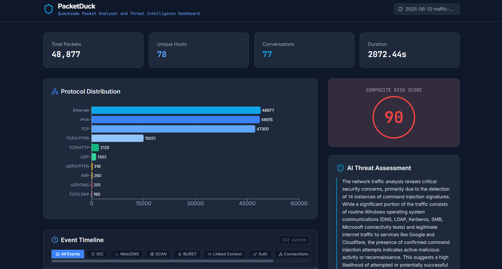
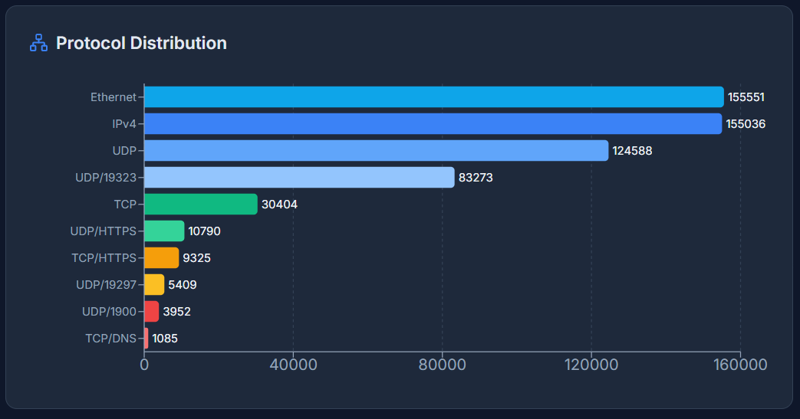
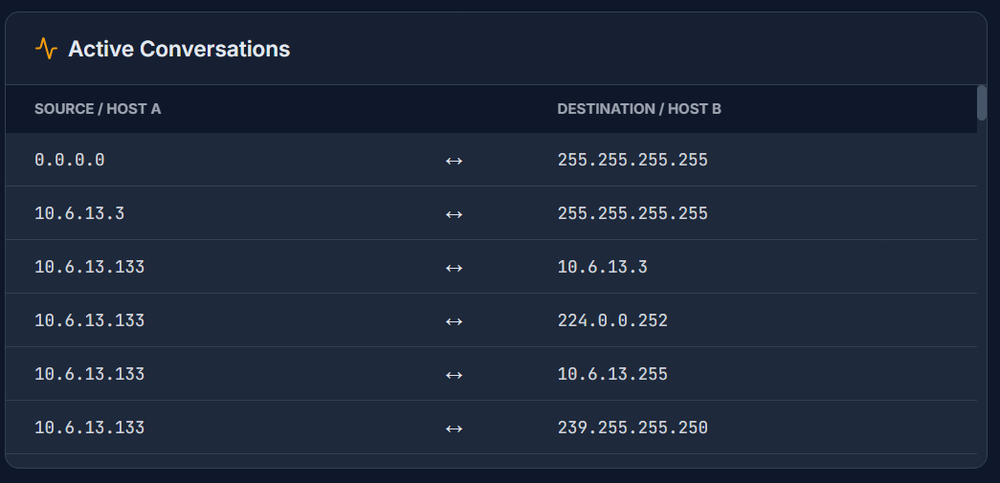
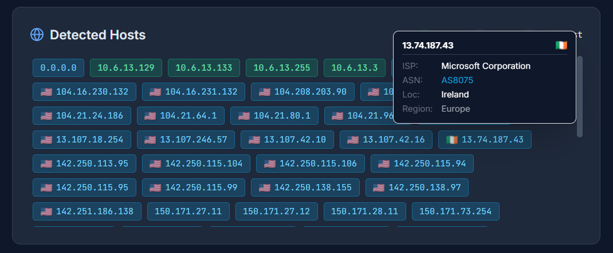
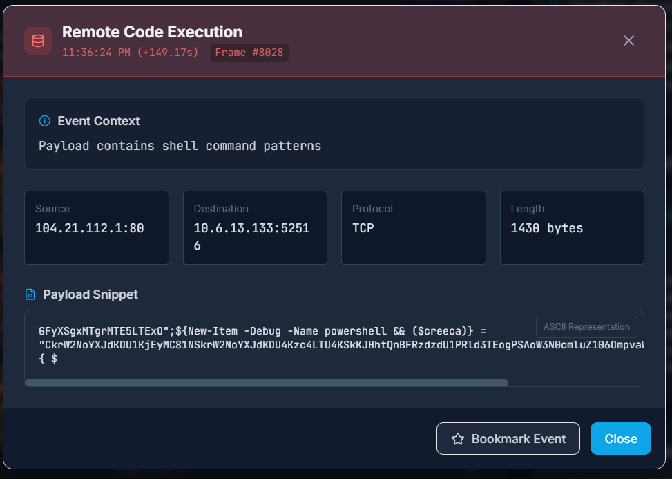
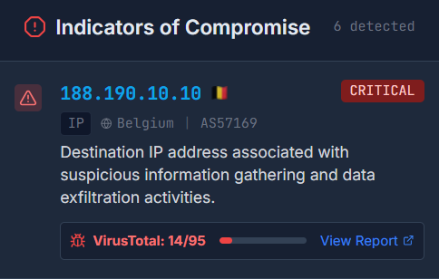

# PacketDuck 🦆



PacketDuck is a modern, client-side **Network Packet Analyzer** and **Threat Intelligence Dashboard**. It parses PCAP files directly in the browser and leverages **Google Gemini AI** to provide forensic insights, risk scoring, and threat detection.

## 🚀 Features

*   **Client-Side Processing**: Parses `.pcap` files entirely in the browser. Your raw packet data stays on your machine until you explicitly choose to analyze threats.
*   **AI-Powered Threat Intel**: Uses Google's Gemini model to analyze traffic patterns, payload anomalies, and generate an executive security assessment.
![]
*   **Interactive Timeline**:
    
    *   **Attack Detection**: Heuristics for SQL Injection, XSS, RCE, and Shellcode.
    *   **Behavioral Analysis**: Detects Traffic Bursts, Port Scans, and Lateral Movement (Pivoting).
    *   **Context Linking**: Visually links related events (e.g., a burst followed by a new connection).
*   **Visualizations**:
    *   Protocol Distribution Charts.
    
    *   Active Conversations Table.
    
    *   Geo-IP Mapping for external hosts.
    
*   **Forensic Tools**:
    *   Payload inspection with ASCII preview.
    
    *   VirusTotal integration for IP reputation checks.
    
    *   PDF Report Generation.
    
## 🛠️ Tech Stack

*   **Frontend**: React 19, TypeScript, Vite
*   **Styling**: Tailwind CSS
*   **AI**: Google GenAI SDK (Gemini 1.5 Flash)
*   **Visualization**: Recharts, Lucide React
*   **Utilities**: jsPDF, html2canvas

## 📦 Installation

1.  **Clone the repository**
    ```bash
    git clone https://github.com/yourusername/packetduck.git
    cd packetduck
    ```

2.  **Install dependencies**
    ```bash
    npm install
    ```

3.  **Configure Environment Variables**
    Create a `.env` file in the root directory:
    ```env
    # Required for AI Analysis
    GEMINI_API_KEY=your_google_gemini_api_key

    # Optional: For IP Reputation checks (Free tier works)
    VT_API_KEY=your_virustotal_api_key
    ```

4.  **Run the development server**
    ```bash
    npm run dev
    ```

## 🔑 Getting API Keys

1.  **Google Gemini API**: Get your key from [Google AI Studio](https://aistudio.google.com/).
2.  **VirusTotal API**: Sign up at [VirusTotal](https://www.virustotal.com/) to get a free public API key.

## 🛡️ Privacy Note

PacketDuck performs the heavy lifting (PCAP parsing) locally.
- **Local Parsing**: The raw binary parsing happens in your browser's memory.
- **AI Analysis**: When you trigger the AI analysis, a *subset* of metadata (summarized logs, top protocols, and specific payload snippets) is sent to the Google Gemini API for processing.

## 📄 License

MIT
